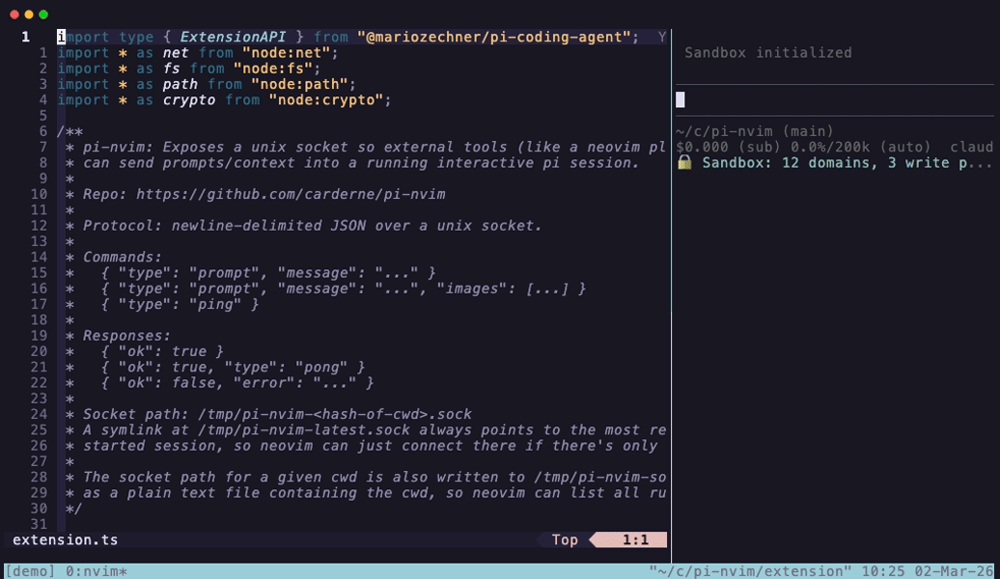

# pi-nvim

Bridge between [pi](https://github.com/badlogic/pi) coding agent and Neovim. Run pi in one terminal pane and Neovim in another — send files, selections, and prompts from Neovim directly into your running pi session.

It also supports **live editor awareness**: the focused Neovim buffer, cursor position, active visual selection, and unsaved in-memory text are synced to pi automatically.



## How it works

The repo contains two components:

1. **Pi extension** (`extension.ts`) — opens a unix socket when pi starts. External tools can send JSON messages to inject prompts into the active pi session.
2. **Neovim plugin** (`lua/pi-nvim/`) — connects to that socket via libuv. Sends context from your editor to pi.

Discovery is automatic: the extension writes socket info to `/tmp/pi-nvim-sockets/`, and the Neovim plugin scans that directory, preferring sessions matching your cwd.

## Install

### Pi side

```bash
pi install npm:pi-nvim
```

Or add to `~/.pi/agent/settings.json`:

```json
{
  "packages": ["https://github.com/carderne/pi-nvim"]
}
```

Then `/reload` in pi.

### Neovim side

With [lazy.nvim](https://github.com/folke/lazy.nvim):

```lua
{ "carderne/pi-nvim" }
```

Then in your config:

```lua
require("pi-nvim").setup({
  context_format = "reference",
  live_context = {
    enabled = true,
    debounce_ms = 150,
    max_buffer_bytes = 200000,
    max_selection_bytes = 50000,
  },
})
```

## Usage

Start pi in one terminal. Start Neovim in another. The pi extension automatically opens a socket on session start.

### Commands

| Command | Description |
|---|---|
| `:Pi` | Open the Send to pi dialog (works in normal and visual mode) |
| `:PiSend` | Type a prompt and send to pi |
| `:PiSendFile` | Send current file path + prompt |
| `:PiSendSelection` | Send visual selection + prompt |
| `:PiSendBuffer` | Send entire buffer + prompt |
| `:PiPing` | Check if pi is reachable |
| `:PiSessions` | List/switch between running pi sessions |

### Live editor awareness

When `require("pi-nvim").setup()` runs, the plugin automatically syncs your focused buffer state to pi in the background.

Pi uses the current editor state through **automatic context injection**: before each user prompt, pi receives a hidden message describing the latest focused file, cursor, selection, and in-memory buffer snapshot when needed.

Saved/unmodified buffers are usually sent by path/reference instead of embedding the whole file. In-memory buffer text is only sent when needed, such as for unsaved changes or unnamed buffers.

### Default keybindings

`<leader>p` is mapped to `:Pi` in both normal and visual mode by default.

### The `:Pi` dialog

Opens a floating window in the center of the screen:

- Shows the current **file name** (always sent)
- If you had a **visual selection**, it shows the line range and sends the selected text
- If no selection, you can press **Tab** to toggle sending the **entire buffer**
- Type a prompt and press **Enter** to send (or just Enter with no prompt)
- Press **Esc** or **Ctrl-C** to cancel

### Additional keybindings

```lua
vim.keymap.set("n", "<leader>pp", ":PiSend<CR>")
vim.keymap.set("n", "<leader>pf", ":PiSendFile<CR>")
vim.keymap.set("v", "<leader>ps", ":PiSendSelection<CR>")
vim.keymap.set("n", "<leader>pb", ":PiSendBuffer<CR>")
vim.keymap.set("n", "<leader>pi", ":PiPing<CR>")
```

## Protocol

The socket accepts newline-delimited JSON:

```json
{"type": "prompt", "message": "your prompt here"}
{"type": "ping"}
```

Responses:

```json
{"ok": true}
{"ok": true, "type": "pong"}
{"ok": false, "error": "..."}
```

This means you can also send prompts from any tool:

```bash
echo '{"type":"prompt","message":"hello"}' | socat - UNIX-CONNECT:/tmp/pi-nvim-sockets/<hash>.sock
```

## License

MIT
